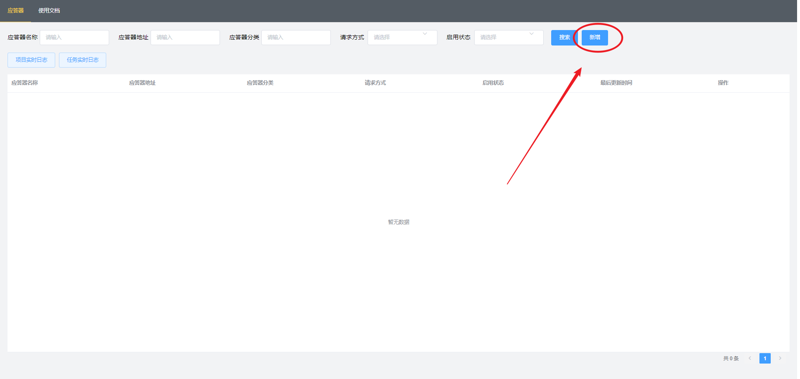
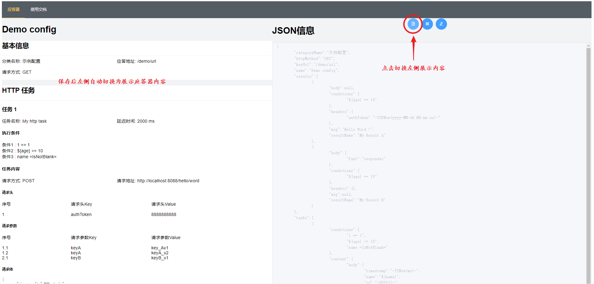

# Fast_Responder 快捷响应服务

v1.0.0-2022.01.17

## 简介

​		Fast_Responder是一个可以让你快速创建Http请求应答器(responder)的服务。应答器可以接收配置的任意请求路径的请求，并按照你的配置对请求参数进行判断，以返回不同的结果。除了处理请求外，应答器还可以对任意个请求地址按你配置的延迟时间发起Http请求。


## 适用场景

写这个服务主要是为了应对工作中遇到的一些特殊场景，比如：

1. 对接第三方接口时,对方提供的接口没有测试环境，或有调用次数限制。
   1. 如果三方接口有调用次数限制（如某签约服务测试环境发起合同次数有限制），可以将需要调用的接口创建为一个应答器，设置合理的返回值，就可以先调试流程代码，确认流程没问题后切换请求域名，调用实际接口，减少对三方接口的调用次数。
2. 团队合作时，所开发的功能需要依赖同事的接口，但同事还没完成接口开发。
   1. 这种情况下通常是自己mock一些数据进行调试，可以将这些mock数据创建到应答器中，方便重复利用，同时避免mock代码忘记删除等意外情况。
3. 要调用的接口是发起一个操作流程，操作完成后会对我方进行回调。但发起操作流程后，该流程难以完成，或耗时很长。
   1. 通过使用应答器来响应发起操作流程的接口，并主动对我方接口进行回调，进而跳过该操作流程。

`*`该服务不适合数据交互需要加解密的场景


## 使用说明

#### 安装说明

运行该服务仅需要一个Mysql服务，要求不低于8.0版本。

1. 在数据库执行项目下src\sqls\init.sql文件
2. 修改配置文件的数据库配置
3. 运行FastResponderApplication

#### 配置示例

```json
{
    "name":"Demo config",
    "httpMethod":"GET",
    "keyUrl":"/demo/url",
    "categoryName":"示例配置",
    "tasks":[
        {
            "conditions":[
                "1 == 1",
                "${age} >= 10",
                "name =IsNotBlank="
            ],
            "content":{
                "body":{
                    "timestemp":"-TSNow(ms)-",
                    "name":"${name}",
                    "id":"-UUID()-"
                },
                "headers":{
                    "authToken":"8888888888"
                },
                "httpMethod":"POST",
                "params":{
                    "keyA":[
                        "key_Av1",
                        "keyA_v2"
                    ],
                    "keyB":[
                        "keyB_v1"
                    ]
                },
                "requestUrl":"http://localhost:8088/hello/word"
            },
            "delayTime":2000,
            "name":"My http task"
        }
    ],
    "results":[
        {
            "body":null,
            "conditions":[
                "${age} == 18"
            ],
            "headers":{
                "authToken":"-TSFNow(yyyy-MM-dd HH:mm:ss)-"
            },
            "msg":"Hello Word !",
            "resultName":"My Result A"
        },
        {
            "body":null,
            "conditions":[
                "${age} == 15"
            ],
            "headers":{

            },
            "msg":null,
            "resultName":"My Result B"
        }
    ]
}
```

字段信息

| 主体         | 类型   | 描述                       | 必填  |
| ------------ | ------ | -------------------------- | ----- |
| name         | string | 应答器名称                 | true  |
| httpMethod   | string | 应答请求方式(大写) | true  |
| keyUrl       | string | 应答地址           | true  |
| categoryName | string | 应答器分类名称             | false |
|                |        |                    |       |
| tasks        | array  | 应答器的任务集             | false |
| \|--name        | string | 任务名称           | true  |
| \|--delayTime  | long   | 延迟时间(ms),默认0 | false |
| \|--conditions  | array  | 任务执行条件       | false |
| \|--content    | obj    | 任务内容           | true  |
| \|--\|--httpMethod | string | 请求方式(大写)     | true  |
| \|--\|--requestUrl | string | 请求地址           | true  |
| \|--\|--headers | map | 请求头 | false |
| \|--\|--params | map | 请求参数(注意value为字符数组) | false |
| \|--\|--body | obj | 请求体 | false |
|                |        |                    |       |
| results      | array  | 返回值列表                 | false |
| \|--resultName | string | 返回值名称 | true |
| \|--body | obj | 响应体 | false |
| \|--msg | string | 响应内容(只有body为null才返回msg) | false |
| \|--conditions | array | 返回执行条件 | false |
| \|--headers | map | 响应头 | false |


#### 字段简述

1. 应答器配置主要由应答器名称，应答地址，应答请求方式，任务集，返回值集五个部分组成。
2. 应答地址和应答请求方式的组合是唯一的。如果出现冲突会在保存时提示。
3. 应答请求方式的取值范围： GET, HEAD, POST, PUT, PATCH, DELETE, OPTIONS, TRACE;
4. 应答器任务集：可配置http请求任务，task会按顺序判断条件，计算通过后创建task，在指定延迟后发起http请求。
5. 返回值集： 可配置多个返回值，按照顺序执行，当某一个返回值条件满足时立即返回。


#### Task说明

1. 当应答器中包含task时，在应答器对接口进行响应之前，会先遍历task集，依次判断执行条件（conditions，如果conditions 是empty，默认为true 。conditions说明见下文），如果条件判断为true，会创建task任务，等待执行。
2. 所有task任务会被缓存在一个无界延迟队列（DelayQueue）中，按照delayTime排序。如果配置的延迟时间相同，多个task可能同时执行（多线程）。
3. task任务目前提供三个自定义配置
   1. httptask.scheduler.thread-pool-size：设置执行task任务的线程池的核心线程数。默认5
   2. httptask.resttemplate.connect-timeout：请求连接超时时间。默认20000（ms）
   3. httptask.resttemplate.read-timeout：请求读取时间。默认20000（ms）
4. task任务中配置的执行条件（conditions），请求地址（requestUrl），请求头（headers），参数（params），请求体（body）均适用`替换操作符`,替换操作符可以对字符进行一些特定处理（见下文）。


#### Result说明

1. 当应答器包含result时，在请求处理的最后阶段，会按顺序遍历result集，依次判断执行条件，如果判断为true，会立即将当前result作为响应进行返回。
2. 可以配置两种类型的返回值。一是返回一个简单的字符串，二是返回一个对象，分别通过msg和body设置。但如果msg和body同时存在，会优先以body返回。例外的是如果运算结果无法转换为对象，会用无法转换的数据替换msg中原本的值。
3. result中配置的响应条件（conditions），响应头（headers），响应内容（msg，body）均适用`替换操作符`（见下文）。


#### condition说明

条件（condition）是用来确定task或result是否执行的表达式（Expression）集，也就是一个集合为一个condition。配置格式为在集合中添加条件表达式。

1. 集合中的每一个元素（表达式）之间的关系可以理解为Java中的`&&`，当前一个表达式结果为false时，后面的表达式不计算，整个condition直接返回false。
2. 如果条件集合为empty，该condition返回true。
3. 表达式格式：参数A+空格+条件符号+空格+参数B。其中参数A和参数B为必填。如果条件符号只需要左条件（参数A），参数B可以不写。条件表达式的三个元素之间的空格不可省略。
4. 条件符号
   1. 等值条件
      1. **==**
         1. 如果参数A和参数B相等返回true。
         2. 不区分数据类型，均按照字符串equals进行比较
         3. 全条件符号，可以是任意数值或字符
      2. **!=**
         1. ==的取反
         2. 全条件符号，可以是任意数值或字符
   2. 数值条件
      1. **>**
      2. **>=**
      3. **<**
      4. **<=**
         1. 区分数据类型，如果参数A和参数B均可以转换为数值类型，会按照比较符号逻辑进行比较，参数A或参数B有不能转换为数值的，直接返回false
         2. 全条件符号
   3. 空判条件
      1. **=IsNull=**
      2. **=IsNotNull=**
      3. **=IsBlank=**
      4. **=IsNotBlank=**
         1. 这四种表达式运算逻辑参考org.apache.commons.lang3.StringUtils的对应方法。
         2. 左条件符号，只需要参数A有值即可。
5. 注意事项！
   1. param参数比较特殊，因为其值是一个数组，所有在需要对url参数进行比对时，只有当param数组只有一个值时，才能正常生效。否则需要手动配置待比较的值为一个数组。


#### ReplaceOperator替换操作符

替换操作符可以对字符串进行特殊处理，如生成数据，引用数据，通过和condition组合可以进行动态逻辑判断。

同一个字符串中可以添加多个替换操作符，但不允许嵌套。

1. 操作符介绍
   1. **${}**
      1. 查询替换符，在{}中间指定字段名
      2. 该操作符可以从请求应答器的请求param，path param，body中查询指定的字段值，并使用该值替换掉当前操作符。
      3. 示例1：
         1. 返回值msg：”你好，我叫${student.name},今年${student.age}岁“。
         2. 请求应答器的请求的请求体：{"code":"200","student":{"name":"小明","age":20}}
         3. 得到的结果msg：”你好，我叫小明,今年20岁“
      4. 示例2：
         1. 返回值msg：”你好，我叫${name},今年${age}岁“。
         2. 请求应答器的请求：http://localhost:8080/getStudent?name=小明&age=20
         3. 得到的结果msg：”你好，我叫小明,今年20岁“
         4. 如果指定的key对应的值是一个对象，将得到一个对象或对象的json字符串
      5. 示例3：
         1. 返回值msg：”你好，我叫${name},今年${age}岁“。
         2. 配置的应答地址： http://localhost:8080/getStudent/{name}/{age}
         3. 请求应答器的请求：http://localhost:8080/getStudent/小明/20
         4. 得到的结果msg：”你好，我叫小明,今年20岁“
   2. **-RDBoolean()-**
      1. 随机一个布尔值替换掉操作符
      2. 示例：
         1. 字符串： “这是一个随机布尔值：-RDBoolean()-”
         2. 结果：  “这是一个随机布尔值：true”
   3. **-RDInt()-**
      1. 随机一个int数值替换掉操作符
      2. 可以在（）中传递参数（下列10,-5,20均为示例值，可换其他值）。
         1. -RDInt()-：返回一个伪随机int值。
         2. -RDInt(10)-：返回0（包含）到10（不包含）直接的位随机数int值。
         3. -RDInt(-5，20)-：返回-5（包括）和20（不包括）之间的伪随机int值。
   4. **-RDLong()-**
      1. 随机一个long数值替换掉操作符
      2. 可以在（）中传递参数（下列10,-5,20均为示例值，可换其他值）。
         1. -RDLong()-：返回一个伪随机long值。
         2. -RDLong(10)-：返回0（包括）和10（不包括）之间的伪随机long值。
         3. -RDLong(-5,20)-：返回-5（包括）和20（不包括）之间的伪随机long值。
   5. **-RDDouble()-**
      1. 随机一个double数值替换掉操作符
      2. 可以在（）中传递参数（下列10.0,-5.0,1.0均为示例值，可换其他值）。
         1. -RDDouble()-：返回0（包括）和1（不包括）之间的伪随机double值。
         2. -RDDouble(10.0)-：返回介于 0.0（包括）和10.0（不包括）之间的伪随机double值。
         3. -RDDouble(-5.0,1.0)-：返回-5.0（包括）和1.0（不包括）之间的伪随机double值。
   6. **-UUID()-**
      1. 随机一个uuid替换掉操作符
      2. 可以在（）中传递限制长度（下列16,64均为示例值，可换其他值）。
         1. -UUID()-：返回一个uuid字符
         2. -UUID(16)-：使用substring函数将uuid裁剪到长度16
         3. -UUID(64)-：循环拼接生成的uuid，知道长度到达64
   7. **-TSNow()-**
      1. 生成当前时间的时间戳替换掉操作符
      2. 可以在（）中传递参数,ms和s为固定值，只能二选一
         1. -TSNow()-：时间戳，单位ms
         2. -TSNow(ms)-：生成毫秒值时间戳
         3. -TSNow(s)-：生成秒值时间戳
   8. **-TSFNow()-**
      1. 根据指定格式生成时间
      2. 可以在（）中传递参数（下列yyyy-MM-dd HH:mm:ss为示例值,可切换其他正确时间格式）
         1. -TSFNow()-：同“-TSNow()-”
         2. -TSFNow(yyyy-MM-dd HH:mm:ss)-：将当前时间转换为“yyyy-MM-dd HH:mm:ss”格式返回


## 演示

使用**配置示例**中的应答器进行演示。

1. 创建并启用应答器

   

   

   

   

   

   

2. 启动用于回调的测试服务

   

3. Postman测试

   1. 不触发任务和返回值

      

   2. 触发ResultA

      

      

   3. 触发ResultB

      

   4. 触发Task,ResultB

      

      

4. 查看日志

   实际使用过程中，经常会需要确认task或项目执行情况，如果只能通过控制台查看会比较麻烦，该项目客户端提供了实时日志查看功能。默认日志等级INFO，可通过配置文件（logback.xml）调整。日志接口默认各接收最多同时10个连接，有新连接进入时，最早连接的连接将被断开。

   1. task日志，仅打印task执行线程的日志

      

      

   2. 项目日志，打印项目的全部日志

      

      

      

      tips: 

      1. 进行过编辑后，会自动禁用，需要重新启用。
      2. keyUrl和httpMethod的组合应该是唯一的，但数据库并没有做限制，所有如果出现重复并同时启用的情况，将按照数据库默认排序获取第一个结果。

      

      感谢你阅读到这里，如有建议或疑问，欢迎给我发送邮件反馈。邮箱silwings@163.com

      ​																																			Silwings

      ​																																	   2022-01-17

      

